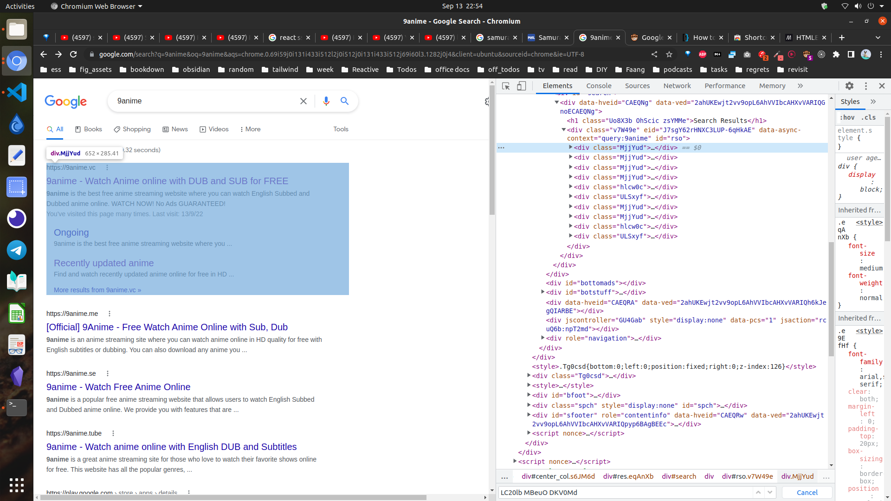

# Google Search Results Navigator

Navigate google search results using tab key

> Change the `let searchResultsSelector = '.MjjYud'` according to the screenshot below if the script doesn't work. Chances are google will replace this `MjjYud` class in future builds so just copy that.
Or you can use `xpath selectors` if that works for you.

